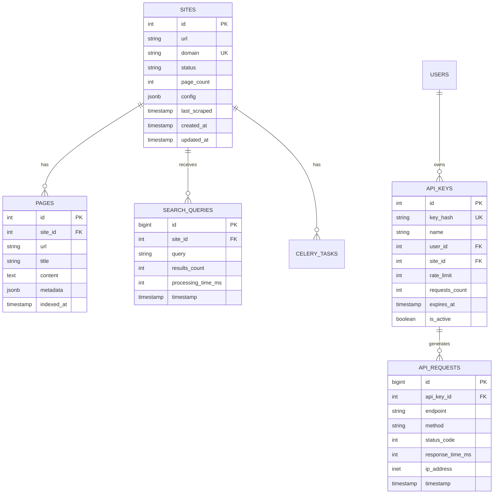

# Database Schema

## Overview

The database schema evolves across phases to support growing functionality.

| Phase | Database | Key Changes |
|-------|----------|-------------|
| 1 | SQLite | Basic tables with FTS5 |
| 2 | PostgreSQL | Migration from SQLite, JSON support |
| 3 | PostgreSQL | Job queue tables, progress tracking |
| 4 | PostgreSQL | API keys, analytics, configuration |
| 5 | PostgreSQL | Partitioning, replicas, optimizations |

---

## Phase 1: SQLite Schema

### Tables

#### sites
```sql
CREATE TABLE sites (
    id INTEGER PRIMARY KEY AUTOINCREMENT,
    url TEXT NOT NULL,
    domain TEXT UNIQUE NOT NULL,
    status TEXT DEFAULT 'pending',
    page_count INTEGER DEFAULT 0,
    last_scraped TIMESTAMP,
    created_at TIMESTAMP DEFAULT CURRENT_TIMESTAMP
);

CREATE INDEX idx_sites_domain ON sites(domain);
CREATE INDEX idx_sites_status ON sites(status);
```

#### pages
```sql
CREATE TABLE pages (
    id INTEGER PRIMARY KEY AUTOINCREMENT,
    site_id INTEGER NOT NULL,
    url TEXT NOT NULL,
    title TEXT,
    content TEXT,
    created_at TIMESTAMP DEFAULT CURRENT_TIMESTAMP,
    FOREIGN KEY (site_id) REFERENCES sites(id)
);

CREATE INDEX idx_pages_site_id ON pages(site_id);
```

#### FTS5 Virtual Table
```sql
CREATE VIRTUAL TABLE pages_fts USING fts5(
    title,
    content,
    content='pages',
    content_rowid='id'
);

-- Triggers to keep FTS index in sync
CREATE TRIGGER pages_ai AFTER INSERT ON pages BEGIN
    INSERT INTO pages_fts(rowid, title, content)
    VALUES (new.id, new.title, new.content);
END;

CREATE TRIGGER pages_ad AFTER DELETE ON pages BEGIN
    INSERT INTO pages_fts(pages_fts, rowid, title, content)
    VALUES ('delete', old.id, old.title, old.content);
END;

CREATE TRIGGER pages_au AFTER UPDATE ON pages BEGIN
    INSERT INTO pages_fts(pages_fts, rowid, title, content)
    VALUES ('delete', old.id, old.title, old.content);
    INSERT INTO pages_fts(rowid, title, content)
    VALUES (new.id, new.title, new.content);
END;
```

---

## Phase 2+: PostgreSQL Schema

### Entity Relationship Diagram

```
┌─────────────┐       ┌─────────────┐       ┌─────────────┐
│    sites    │       │    pages    │       │  api_keys   │
├─────────────┤       ├─────────────┤       ├─────────────┤
│ id (PK)     │──────▶│ id (PK)     │       │ id (PK)     │
│ url         │       │ site_id(FK) │       │ key_hash    │
│ domain      │       │ url         │       │ name        │
│ status      │       │ title       │       │ user_id(FK) │
│ page_count  │       │ content     │       │ site_id(FK) │
│ config(JSON)│       │ metadata    │       │ rate_limit  │
│ last_scraped│       │ indexed_at  │       │ requests    │
│ created_at  │       │             │       │ expires_at  │
└─────────────┘       └─────────────┘       └─────────────┘
       │                                           │
       ▼                                           ▼
┌─────────────┐                           ┌─────────────┐
│search_queries│                          │api_requests │
├─────────────┤                           ├─────────────┤
│ id (PK)     │                           │ id (PK)     │
│ site_id(FK) │                           │ api_key_id  │
│ query       │                           │ endpoint    │
│ results_count│                          │ method      │
│ timestamp   │                           │ status_code │
└─────────────┘                           │ duration_ms │
                                          │ timestamp   │
                                          └─────────────┘
```

### Detailed Schema

#### sites
```sql
CREATE TABLE sites (
    id SERIAL PRIMARY KEY,
    url VARCHAR(2048) NOT NULL,
    domain VARCHAR(255) UNIQUE NOT NULL,
    status VARCHAR(20) DEFAULT 'pending' 
        CHECK (status IN ('pending', 'scraping', 'completed', 'failed')),
    page_count INTEGER DEFAULT 0,
    config JSONB DEFAULT '{}',
    last_scraped TIMESTAMP WITH TIME ZONE,
    created_at TIMESTAMP WITH TIME ZONE DEFAULT CURRENT_TIMESTAMP,
    updated_at TIMESTAMP WITH TIME ZONE DEFAULT CURRENT_TIMESTAMP
);

-- Indexes
CREATE INDEX idx_sites_domain ON sites(domain);
CREATE INDEX idx_sites_status ON sites(status);
CREATE INDEX idx_sites_created ON sites(created_at);

-- GIN index for JSONB queries
CREATE INDEX idx_sites_config ON sites USING GIN (config);

-- Trigger to update updated_at
CREATE OR REPLACE FUNCTION update_updated_at_column()
RETURNS TRIGGER AS $$
BEGIN
    NEW.updated_at = CURRENT_TIMESTAMP;
    RETURN NEW;
END;
$$ language 'plpgsql';

CREATE TRIGGER update_sites_updated_at 
    BEFORE UPDATE ON sites 
    FOR EACH ROW 
    EXECUTE FUNCTION update_updated_at_column();
```

**Config JSON Schema:**
```json
{
  "content_selector": "body",
  "title_selector": "title",
  "exclude_selectors": [".ads", ".sidebar"],
  "max_depth": 2,
  "delay_ms": 100,
  "respect_robots_txt": true,
  "include_patterns": [".*"],
  "exclude_patterns": [],
  "auto_reindex": false,
  "reindex_interval_days": 7,
  "custom_headers": {},
  "user_agent": null
}
```

#### pages
```sql
CREATE TABLE pages (
    id SERIAL PRIMARY KEY,
    site_id INTEGER NOT NULL REFERENCES sites(id) ON DELETE CASCADE,
    url VARCHAR(2048) NOT NULL,
    title VARCHAR(500),
    content TEXT,
    metadata JSONB DEFAULT '{}',
    indexed_at TIMESTAMP WITH TIME ZONE DEFAULT CURRENT_TIMESTAMP,
    created_at TIMESTAMP WITH TIME ZONE DEFAULT CURRENT_TIMESTAMP
);

-- Indexes
CREATE INDEX idx_pages_site_id ON pages(site_id);
CREATE INDEX idx_pages_url ON pages(url);
CREATE INDEX idx_pages_indexed_at ON pages(indexed_at);
CREATE INDEX idx_pages_metadata ON pages USING GIN (metadata);

-- Partial index for full-text search (Phase 5 optimization)
CREATE INDEX idx_pages_content_search ON pages 
    USING gin(to_tsvector('english', content));
```

**Metadata JSON Schema:**
```json
{
  "headers": {
    "h1": ["Main Heading"],
    "h2": ["Subheading 1", "Subheading 2"]
  },
  "links": 45,
  "word_count": 1250,
  "language": "en",
  "charset": "utf-8"
}
```

#### api_keys
```sql
CREATE TABLE api_keys (
    id SERIAL PRIMARY KEY,
    key_hash VARCHAR(64) UNIQUE NOT NULL,
    name VARCHAR(255),
    user_id INTEGER REFERENCES users(id) ON DELETE SET NULL,
    site_id INTEGER REFERENCES sites(id) ON DELETE SET NULL,
    rate_limit_per_minute INTEGER DEFAULT 100,
    requests_count INTEGER DEFAULT 0,
    last_used_at TIMESTAMP WITH TIME ZONE,
    created_at TIMESTAMP WITH TIME ZONE DEFAULT CURRENT_TIMESTAMP,
    expires_at TIMESTAMP WITH TIME ZONE,
    is_active BOOLEAN DEFAULT TRUE
);

-- Indexes
CREATE INDEX idx_api_keys_hash ON api_keys(key_hash);
CREATE INDEX idx_api_keys_user ON api_keys(user_id);
CREATE INDEX idx_api_keys_site ON api_keys(site_id);
CREATE INDEX idx_api_keys_active ON api_keys(is_active) WHERE is_active = TRUE;
```

#### api_requests
```sql
CREATE TABLE api_requests (
    id BIGSERIAL PRIMARY KEY,
    api_key_id INTEGER REFERENCES api_keys(id) ON DELETE SET NULL,
    endpoint VARCHAR(255) NOT NULL,
    method VARCHAR(10) NOT NULL,
    status_code INTEGER,
    response_time_ms INTEGER,
    ip_address INET,
    user_agent TEXT,
    timestamp TIMESTAMP WITH TIME ZONE DEFAULT CURRENT_TIMESTAMP
);

-- Indexes
CREATE INDEX idx_api_requests_key ON api_requests(api_key_id);
CREATE INDEX idx_api_requests_timestamp ON api_requests(timestamp);
CREATE INDEX idx_api_requests_endpoint ON api_requests(endpoint);

-- Partitioning for time-series data (Phase 5)
-- Monthly partitions for high-volume tables
```

#### search_queries
```sql
CREATE TABLE search_queries (
    id BIGSERIAL PRIMARY KEY,
    site_id INTEGER REFERENCES sites(id) ON DELETE SET NULL,
    query VARCHAR(500) NOT NULL,
    results_count INTEGER,
    processing_time_ms INTEGER,
    ip_address INET,
    timestamp TIMESTAMP WITH TIME ZONE DEFAULT CURRENT_TIMESTAMP
);

-- Indexes
CREATE INDEX idx_search_queries_site ON search_queries(site_id);
CREATE INDEX idx_search_queries_timestamp ON search_queries(timestamp);
CREATE INDEX idx_search_queries_query ON search_queries(query);

-- For analytics queries
CREATE INDEX idx_search_queries_site_time ON search_queries(site_id, timestamp);
```

#### users (Optional, for future authentication)
```sql
CREATE TABLE users (
    id SERIAL PRIMARY KEY,
    email VARCHAR(255) UNIQUE NOT NULL,
    password_hash VARCHAR(255),
    is_active BOOLEAN DEFAULT TRUE,
    is_admin BOOLEAN DEFAULT FALSE,
    created_at TIMESTAMP WITH TIME ZONE DEFAULT CURRENT_TIMESTAMP,
    last_login TIMESTAMP WITH TIME ZONE
);

CREATE INDEX idx_users_email ON users(email);
```

---

## Phase 3+: Job Queue Tables

### Celery Job Tracking

#### celery_tasks (Optional enhancement)
```sql
CREATE TABLE celery_tasks (
    id SERIAL PRIMARY KEY,
    task_id VARCHAR(255) UNIQUE NOT NULL,
    site_id INTEGER REFERENCES sites(id),
    task_name VARCHAR(255) NOT NULL,
    status VARCHAR(20) DEFAULT 'pending'
        CHECK (status IN ('pending', 'started', 'success', 'failure', 'retry')),
    result JSONB,
    error_message TEXT,
    started_at TIMESTAMP WITH TIME ZONE,
    completed_at TIMESTAMP WITH TIME ZONE,
    created_at TIMESTAMP WITH TIME ZONE DEFAULT CURRENT_TIMESTAMP
);

CREATE INDEX idx_celery_tasks_site ON celery_tasks(site_id);
CREATE INDEX idx_celery_tasks_status ON celery_tasks(status);
CREATE INDEX idx_celery_tasks_created ON celery_tasks(created_at);
```

---

## Migrations

### Alembic Setup

**Directory Structure:**
```
alembic/
├── versions/          # Migration files
├── env.py            # Alembic environment
├── script.py.mako    # Migration template
└── alembic.ini       # Configuration
```

**Initial Migration:**
```python
# alembic/versions/001_initial_schema.py
"""Initial schema

Revision ID: 001
Revises: 
Create Date: 2024-01-15 00:00:00.000000

"""
from alembic import op
import sqlalchemy as sa
from sqlalchemy.dialects import postgresql

revision = '001'
down_revision = None
branch_labels = None
depends_on = None

def upgrade():
    # Create sites table
    op.create_table(
        'sites',
        sa.Column('id', sa.Integer(), nullable=False),
        sa.Column('url', sa.String(length=2048), nullable=False),
        sa.Column('domain', sa.String(length=255), nullable=False),
        sa.Column('status', sa.String(length=20), nullable=True),
        sa.Column('page_count', sa.Integer(), nullable=True),
        sa.Column('config', postgresql.JSONB(astext_type=sa.Text()), nullable=True),
        sa.Column('last_scraped', sa.DateTime(timezone=True), nullable=True),
        sa.Column('created_at', sa.DateTime(timezone=True), server_default=sa.text('CURRENT_TIMESTAMP')),
        sa.Column('updated_at', sa.DateTime(timezone=True), server_default=sa.text('CURRENT_TIMESTAMP')),
        sa.PrimaryKeyConstraint('id'),
        sa.UniqueConstraint('domain')
    )
    
    # Create pages table
    op.create_table(
        'pages',
        sa.Column('id', sa.Integer(), nullable=False),
        sa.Column('site_id', sa.Integer(), nullable=False),
        sa.Column('url', sa.String(length=2048), nullable=False),
        sa.Column('title', sa.String(length=500), nullable=True),
        sa.Column('content', sa.Text(), nullable=True),
        sa.Column('metadata', postgresql.JSONB(astext_type=sa.Text()), nullable=True),
        sa.Column('indexed_at', sa.DateTime(timezone=True), server_default=sa.text('CURRENT_TIMESTAMP')),
        sa.Column('created_at', sa.DateTime(timezone=True), server_default=sa.text('CURRENT_TIMESTAMP')),
        sa.ForeignKeyConstraint(['site_id'], ['sites.id'], ondelete='CASCADE'),
        sa.PrimaryKeyConstraint('id')
    )
    
    # Create indexes
    op.create_index('idx_sites_domain', 'sites', ['domain'])
    op.create_index('idx_sites_status', 'sites', ['status'])
    op.create_index('idx_pages_site_id', 'pages', ['site_id'])
    op.create_index('idx_pages_url', 'pages', ['url'])

def downgrade():
    op.drop_index('idx_pages_url', table_name='pages')
    op.drop_index('idx_pages_site_id', table_name='pages')
    op.drop_index('idx_sites_status', table_name='sites')
    op.drop_index('idx_sites_domain', table_name='sites')
    op.drop_table('pages')
    op.drop_table('sites')
```

**Migration Commands:**
```bash
# Create new migration
alembic revision --autogenerate -m "Add api_keys table"

# Apply migrations
alembic upgrade head

# Rollback one migration
alembic downgrade -1

# View current version
alembic current

# View migration history
alembic history --verbose
```

---

## Phase 5: Advanced Features

### Table Partitioning

For high-volume tables (api_requests, search_queries):

```sql
-- Create partitioned table for search_queries
CREATE TABLE search_queries_partitioned (
    id BIGSERIAL,
    site_id INTEGER,
    query VARCHAR(500),
    results_count INTEGER,
    processing_time_ms INTEGER,
    ip_address INET,
    timestamp TIMESTAMP WITH TIME ZONE NOT NULL,
    PRIMARY KEY (id, timestamp)
) PARTITION BY RANGE (timestamp);

-- Create monthly partitions
CREATE TABLE search_queries_y2024m01 
    PARTITION OF search_queries_partitioned
    FOR VALUES FROM ('2024-01-01') TO ('2024-02-01');

CREATE TABLE search_queries_y2024m02 
    PARTITION OF search_queries_partitioned
    FOR VALUES FROM ('2024-02-01') TO ('2024-03-01');

-- Automated partition creation (via cron or trigger)
```

### Read Replicas

**Connection Configuration:**
```python
# Read from replicas, write to primary
engine = create_async_engine(
    primary_database_url,
    connect_args={"options": "-c default_transaction_read_only=off"}
)

read_engine = create_async_engine(
    replica_database_url,
    connect_args={"options": "-c default_transaction_read_only=on"}
)
```

### Connection Pooling

**Recommended Settings:**
```python
engine = create_async_engine(
    database_url,
    pool_size=20,              # Base connections
    max_overflow=10,           # Additional connections under load
    pool_timeout=30,           # Wait time for connection
    pool_recycle=1800,         # Recycle connections after 30 min
    pool_pre_ping=True,        # Verify connections before use
)
```

---

## Backup Strategy

### Logical Backup (pg_dump)
```bash
# Full backup
pg_dump -h localhost -U user -d sitesearch > backup.sql

# Compressed backup
pg_dump -h localhost -U user -d sitesearch | gzip > backup.sql.gz

# Specific tables
pg_dump -h localhost -U user -d sitesearch -t sites -t pages > backup.sql
```

### Continuous Archiving (WAL)
```sql
-- postgresql.conf
wal_level = replica
archive_mode = on
archive_command = 'cp %p /backups/wal/%f'
max_wal_senders = 3
```

### Point-in-Time Recovery
```bash
# Restore base backup
gunzip -c backup.sql.gz | psql -h localhost -U user -d sitesearch

# Apply WAL archives
# (Using pg_basebackup and pg_waldump)
```

---

## Performance Optimization

### Query Optimization

**Common Queries:**

1. **Get site by domain:**
```sql
-- Fast with index
SELECT * FROM sites WHERE domain = 'example.com';
```

2. **Get pages for site:**
```sql
-- Paginated query
SELECT * FROM pages 
WHERE site_id = 1 
ORDER BY indexed_at DESC 
LIMIT 20 OFFSET 0;
```

3. **Search queries analytics:**
```sql
-- Time-series aggregation (use partition pruning)
SELECT 
    DATE(timestamp) as date,
    COUNT(*) as query_count,
    AVG(results_count) as avg_results
FROM search_queries
WHERE site_id = 1 
  AND timestamp >= '2024-01-01'
  AND timestamp < '2024-02-01'
GROUP BY DATE(timestamp)
ORDER BY date;
```

### Index Maintenance

```sql
-- Analyze tables for query planner
ANALYZE sites;
ANALYZE pages;

-- Reindex for performance
REINDEX INDEX CONCURRENTLY idx_pages_site_id;

-- Check index usage
SELECT 
    schemaname,
    tablename,
    indexname,
    idx_scan,
    idx_tup_read,
    idx_tup_fetch
FROM pg_stat_user_indexes
WHERE schemaname = 'public'
ORDER BY idx_scan DESC;
```

### Vacuum and Maintenance

```sql
-- Regular vacuum (should run automatically with autovacuum)
VACUUM ANALYZE pages;

-- Full vacuum (requires exclusive lock)
VACUUM FULL;

-- Check table bloat
SELECT 
    schemaname,
    tablename,
    pg_size_pretty(pg_total_relation_size(schemaname||'.'||tablename)) as size
FROM pg_tables
WHERE schemaname = 'public'
ORDER BY pg_total_relation_size(schemaname||'.'||tablename) DESC;
```

---

## Data Retention

### Automated Cleanup

```sql
-- Archive old search queries (older than 90 days)
CREATE OR REPLACE FUNCTION archive_old_queries()
RETURNS void AS $$
BEGIN
    INSERT INTO search_queries_archive 
    SELECT * FROM search_queries 
    WHERE timestamp < CURRENT_DATE - INTERVAL '90 days';
    
    DELETE FROM search_queries 
    WHERE timestamp < CURRENT_DATE - INTERVAL '90 days';
END;
$$ LANGUAGE plpgsql;

-- Run daily via cron or pg_cron
SELECT archive_old_queries();
```

### GDPR Compliance

```sql
-- Anonymize old data
UPDATE search_queries 
SET ip_address = NULL,
    query = '[REDACTED]'
WHERE timestamp < CURRENT_DATE - INTERVAL '365 days';
```

---

## Schema Version History

| Version | Date | Changes |
|---------|------|---------|
| 1.0 | 2024-01-15 | Initial schema (SQLite) |
| 2.0 | 2024-01-29 | PostgreSQL migration |
| 2.1 | 2024-02-12 | Add job queue tables |
| 2.2 | 2024-02-26 | Add API keys, analytics |
| 3.0 | 2024-03-11 | Partitioning, replicas |

---

## ER Diagram (Mermaid)


